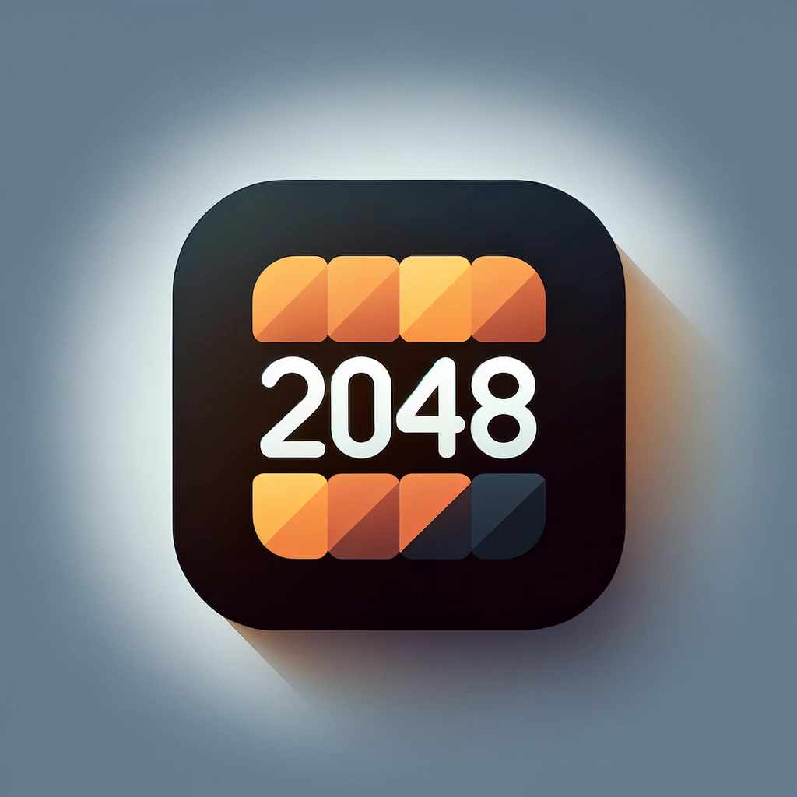

# Jeu du 2048

Jeu du 2048 codé en Fortran, avec l'aide de la bibliothèque C Raylib.
<p align="center">
	<br>
	
</p>
## Règles

Bougez les carrés avec les flèches du clavier. Lorsque deux nombres similaires sont côte-à-côte, ils s'assembleront pour former la puissance de 2 supérieure. Le but est d'arriver à combiner assez de cases pour atteindre la valeur de 2048. Lorsque qu'il ne reste aucune case de disponible, et qu'aucun mouvement ne mène à l'association de deux cases, la partie est perdue.

> [!NOTE]
> Comparé au jeu habituel du 2048, le score est calculé différemment; il est simplement la somme de la valeur des cases sur la grille.

---

### Téléchargement

Des exécutables sont disponibles au téléchargement :

|OS|Architecture|Lien|
|--:|:--|
|Windows| x86-64|[win_x86-64_fortran-2048.zip](https://github.com/lukbrb/fortran-2048/releases/download/release_v1.0.0-beta/win64_fortran-2048-1.0.zip)|
|Debian|amd64|[linux_amd64_fortran-2048.tar.xz](https://github.com/lukbrb/fortran-2048/releases/download/release_v1.0.0-beta/linux_amd64_fortran-2048-1.0.tar.xz)|

### Compilation

Suivez les instructions suivantes si aucun exécutable n'est disponible pour votre plateforme, ou si vous souhaitez le compiler vous-même.

> [!WARNING]
> Il est nécessaire pour cette étape d'avoir un compilateur Fortran.
> Les étapes suivantes sont testées avec `gfortran`

#### 1. Clonâge du répertoire

Pour commencer, ouvrez un terminal et placez-vous dans votre dossier de travail. Clônez le répertoire de `fortran-2048`, et placez vous dedans :

``` console
git clone https://github.com/lukbrb/fortran-2048.git
cd fortran-2048
```

> [!NOTE]
> Si vous ne disposez pas de `git`, vous pouvez télécharger un fichier zip contenant le code source [ici](https://github.com/lukbrb/fortran-2048/archive/refs/heads/master.zip)

Avant de pouvoir compiler le projet, il nous faut installer `raylib`.

#### 2. Télécharger raylib

> [!NOTE] Une version préliminaire du script `setup.py` permet d'automatiser l'étape > Pour l'utiliser, simplement taper
>
>```console
>$ python setup.py
>```
>
> sous Windows ou MacOS. Sous Linux il faudra certainement remplacer `python` par `python3`. Le script essaie de déterminer l'OS ainsi que l'architecture de votre machine, afin de sélectionner le binaire `raylib` adapté. De plus, il organisera la structure des dossiers `lib/` et `include/`, et renommera le fichier raylib téléchargé. Il vous demandera ensuite si vous souhaitez compiler le programme.

Le moyen le plus simple est de télécharger un fichier binaire précompilé de `raylib`. Le dernier lancement en date (29/02/2024) est celui de `raylib 5.0` . Les fichiers binaires sont à télécharger dans la rubrique *Assets* (en bas de page) à l'url suivante : <https://github.com/raysan5/raylib/releases/tag/5.0>. Vous y trouverez la table suivante
<div data-view-component="true" class="Box Box--condensed mt-3">
  
    <ul data-view-component="true">
        <li data-view-component="true" class="Box-row d-flex flex-column flex-md-row">      <div data-view-component="true" class="d-flex flex-justify-start col-12 col-lg-9">
        <svg aria-hidden="true" height="16" viewBox="0 0 16 16" version="1.1" width="16" data-view-component="true" class="octicon octicon-package color-fg-muted">
    <path d="m8.878.392 5.25 3.045c.54.314.872.89.872 1.514v6.098a1.75 1.75 0 0 1-.872 1.514l-5.25 3.045a1.75 1.75 0 0 1-1.756 0l-5.25-3.045A1.75 1.75 0 0 1 1 11.049V4.951c0-.624.332-1.201.872-1.514L7.122.392a1.75 1.75 0 0 1 1.756 0ZM7.875 1.69l-4.63 2.685L8 7.133l4.755-2.758-4.63-2.685a.248.248 0 0 0-.25 0ZM2.5 5.677v5.372c0 .09.047.171.125.216l4.625 2.683V8.432Zm6.25 8.271 4.625-2.683a.25.25 0 0 0 .125-.216V5.677L8.75 8.432Z"></path>
</svg>
        <a href="/raysan5/raylib/releases/download/5.0/raylib-5.0_linux_amd64.tar.gz" rel="nofollow" data-turbo="false" data-view-component="true" class="Truncate">
    <span data-view-component="true" class="Truncate-text text-bold">raylib-5.0_linux_amd64.tar.gz</span>
    <span data-view-component="true" class="Truncate-text"></span>
</a></div>      <div data-view-component="true" class="d-flex flex-auto flex-justify-end col-md-4 ml-3 ml-md-0 mt-1 mt-md-0 pl-1 pl-md-0">
          <span style="white-space: nowrap;" data-view-component="true" class="color-fg-muted text-sm-left flex-auto ml-md-3">1.76 MB</span>
          <span style="white-space: nowrap;" data-view-component="true" class="color-fg-muted text-right flex-shrink-0 flex-grow-0 ml-3"><relative-time datetime="2023-11-18T12:07:47Z" class="no-wrap" prefix="" title="Nov 18, 2023, 1:07 PM GMT+1">2023-11-18T12:07:47Z</relative-time></span>
</div></li>
        <li data-view-component="true" class="Box-row d-flex flex-column flex-md-row">      <div data-view-component="true" class="d-flex flex-justify-start col-12 col-lg-9">
        <svg aria-hidden="true" height="16" viewBox="0 0 16 16" version="1.1" width="16" data-view-component="true" class="octicon octicon-package color-fg-muted">
    <path d="m8.878.392 5.25 3.045c.54.314.872.89.872 1.514v6.098a1.75 1.75 0 0 1-.872 1.514l-5.25 3.045a1.75 1.75 0 0 1-1.756 0l-5.25-3.045A1.75 1.75 0 0 1 1 11.049V4.951c0-.624.332-1.201.872-1.514L7.122.392a1.75 1.75 0 0 1 1.756 0ZM7.875 1.69l-4.63 2.685L8 7.133l4.755-2.758-4.63-2.685a.248.248 0 0 0-.25 0ZM2.5 5.677v5.372c0 .09.047.171.125.216l4.625 2.683V8.432Zm6.25 8.271 4.625-2.683a.25.25 0 0 0 .125-.216V5.677L8.75 8.432Z"></path>
</svg>
        <a href="/raysan5/raylib/releases/download/5.0/raylib-5.0_linux_i386.tar.gz" rel="nofollow" data-turbo="false" data-view-component="true" class="Truncate">
    <span data-view-component="true" class="Truncate-text text-bold">raylib-5.0_linux_i386.tar.gz</span>
    <span data-view-component="true" class="Truncate-text"></span>
</a></div>      <div data-view-component="true" class="d-flex flex-auto flex-justify-end col-md-4 ml-3 ml-md-0 mt-1 mt-md-0 pl-1 pl-md-0">
          <span style="white-space: nowrap;" data-view-component="true" class="color-fg-muted text-sm-left flex-auto ml-md-3">1020 KB</span>
          <span style="white-space: nowrap;" data-view-component="true" class="color-fg-muted text-right flex-shrink-0 flex-grow-0 ml-3"><relative-time datetime="2023-11-18T12:06:42Z" class="no-wrap" prefix="" title="Nov 18, 2023, 1:06 PM GMT+1">2023-11-18T12:06:42Z</relative-time></span>
</div></li>
        <li data-view-component="true" class="Box-row d-flex flex-column flex-md-row">      <div data-view-component="true" class="d-flex flex-justify-start col-12 col-lg-9">
        <svg aria-hidden="true" height="16" viewBox="0 0 16 16" version="1.1" width="16" data-view-component="true" class="octicon octicon-package color-fg-muted">
    <path d="m8.878.392 5.25 3.045c.54.314.872.89.872 1.514v6.098a1.75 1.75 0 0 1-.872 1.514l-5.25 3.045a1.75 1.75 0 0 1-1.756 0l-5.25-3.045A1.75 1.75 0 0 1 1 11.049V4.951c0-.624.332-1.201.872-1.514L7.122.392a1.75 1.75 0 0 1 1.756 0ZM7.875 1.69l-4.63 2.685L8 7.133l4.755-2.758-4.63-2.685a.248.248 0 0 0-.25 0ZM2.5 5.677v5.372c0 .09.047.171.125.216l4.625 2.683V8.432Zm6.25 8.271 4.625-2.683a.25.25 0 0 0 .125-.216V5.677L8.75 8.432Z"></path>
</svg>
        <a href="/raysan5/raylib/releases/download/5.0/raylib-5.0_macos.tar.gz" rel="nofollow" data-turbo="false" data-view-component="true" class="Truncate">
    <span data-view-component="true" class="Truncate-text text-bold">raylib-5.0_macos.tar.gz</span>
    <span data-view-component="true" class="Truncate-text"></span>
</a></div>      <div data-view-component="true" class="d-flex flex-auto flex-justify-end col-md-4 ml-3 ml-md-0 mt-1 mt-md-0 pl-1 pl-md-0">
          <span style="white-space: nowrap;" data-view-component="true" class="color-fg-muted text-sm-left flex-auto ml-md-3">2.96 MB</span>
          <span style="white-space: nowrap;" data-view-component="true" class="color-fg-muted text-right flex-shrink-0 flex-grow-0 ml-3"><relative-time datetime="2023-11-18T12:07:50Z" class="no-wrap" prefix="" title="Nov 18, 2023, 1:07 PM GMT+1">2023-11-18T12:07:50Z</relative-time></span>
</div></li>
        <li data-view-component="true" class="Box-row d-flex flex-column flex-md-row">      <div data-view-component="true" class="d-flex flex-justify-start col-12 col-lg-9">
        <svg aria-hidden="true" height="16" viewBox="0 0 16 16" version="1.1" width="16" data-view-component="true" class="octicon octicon-package color-fg-muted">
    <path d="m8.878.392 5.25 3.045c.54.314.872.89.872 1.514v6.098a1.75 1.75 0 0 1-.872 1.514l-5.25 3.045a1.75 1.75 0 0 1-1.756 0l-5.25-3.045A1.75 1.75 0 0 1 1 11.049V4.951c0-.624.332-1.201.872-1.514L7.122.392a1.75 1.75 0 0 1 1.756 0ZM7.875 1.69l-4.63 2.685L8 7.133l4.755-2.758-4.63-2.685a.248.248 0 0 0-.25 0ZM2.5 5.677v5.372c0 .09.047.171.125.216l4.625 2.683V8.432Zm6.25 8.271 4.625-2.683a.25.25 0 0 0 .125-.216V5.677L8.75 8.432Z"></path>
</svg>
        <a href="/raysan5/raylib/releases/download/5.0/raylib-5.0_webassembly.zip" rel="nofollow" data-turbo="false" data-view-component="true" class="Truncate">
    <span data-view-component="true" class="Truncate-text text-bold">raylib-5.0_webassembly.zip</span>
    <span data-view-component="true" class="Truncate-text"></span>
</a></div>      <div data-view-component="true" class="d-flex flex-auto flex-justify-end col-md-4 ml-3 ml-md-0 mt-1 mt-md-0 pl-1 pl-md-0">
          <span style="white-space: nowrap;" data-view-component="true" class="color-fg-muted text-sm-left flex-auto ml-md-3">572 KB</span>
          <span style="white-space: nowrap;" data-view-component="true" class="color-fg-muted text-right flex-shrink-0 flex-grow-0 ml-3"><relative-time datetime="2023-11-18T12:06:55Z" class="no-wrap" prefix="" title="Nov 18, 2023, 1:06 PM GMT+1">2023-11-18T12:06:55Z</relative-time></span>
</div></li>
        <li data-view-component="true" class="Box-row d-flex flex-column flex-md-row">      <div data-view-component="true" class="d-flex flex-justify-start col-12 col-lg-9">
        <svg aria-hidden="true" height="16" viewBox="0 0 16 16" version="1.1" width="16" data-view-component="true" class="octicon octicon-package color-fg-muted">
    <path d="m8.878.392 5.25 3.045c.54.314.872.89.872 1.514v6.098a1.75 1.75 0 0 1-.872 1.514l-5.25 3.045a1.75 1.75 0 0 1-1.756 0l-5.25-3.045A1.75 1.75 0 0 1 1 11.049V4.951c0-.624.332-1.201.872-1.514L7.122.392a1.75 1.75 0 0 1 1.756 0ZM7.875 1.69l-4.63 2.685L8 7.133l4.755-2.758-4.63-2.685a.248.248 0 0 0-.25 0ZM2.5 5.677v5.372c0 .09.047.171.125.216l4.625 2.683V8.432Zm6.25 8.271 4.625-2.683a.25.25 0 0 0 .125-.216V5.677L8.75 8.432Z"></path>
</svg>
        <a href="/raysan5/raylib/releases/download/5.0/raylib-5.0_win32_mingw-w64.zip" rel="nofollow" data-turbo="false" data-view-component="true" class="Truncate">
    <span data-view-component="true" class="Truncate-text text-bold">raylib-5.0_win32_mingw-w64.zip</span>
    <span data-view-component="true" class="Truncate-text"></span>
</a></div>      <div data-view-component="true" class="d-flex flex-auto flex-justify-end col-md-4 ml-3 ml-md-0 mt-1 mt-md-0 pl-1 pl-md-0">
          <span style="white-space: nowrap;" data-view-component="true" class="color-fg-muted text-sm-left flex-auto ml-md-3">789 KB</span>
          <span style="white-space: nowrap;" data-view-component="true" class="color-fg-muted text-right flex-shrink-0 flex-grow-0 ml-3"><relative-time datetime="2023-11-18T12:06:41Z" class="no-wrap" prefix="" title="Nov 18, 2023, 1:06 PM GMT+1">2023-11-18T12:06:41Z</relative-time></span>
</div></li>
        <li data-view-component="true" class="Box-row d-flex flex-column flex-md-row">      <div data-view-component="true" class="d-flex flex-justify-start col-12 col-lg-9">
        <svg aria-hidden="true" height="16" viewBox="0 0 16 16" version="1.1" width="16" data-view-component="true" class="octicon octicon-package color-fg-muted">
    <path d="m8.878.392 5.25 3.045c.54.314.872.89.872 1.514v6.098a1.75 1.75 0 0 1-.872 1.514l-5.25 3.045a1.75 1.75 0 0 1-1.756 0l-5.25-3.045A1.75 1.75 0 0 1 1 11.049V4.951c0-.624.332-1.201.872-1.514L7.122.392a1.75 1.75 0 0 1 1.756 0ZM7.875 1.69l-4.63 2.685L8 7.133l4.755-2.758-4.63-2.685a.248.248 0 0 0-.25 0ZM2.5 5.677v5.372c0 .09.047.171.125.216l4.625 2.683V8.432Zm6.25 8.271 4.625-2.683a.25.25 0 0 0 .125-.216V5.677L8.75 8.432Z"></path>
</svg>
        <a href="/raysan5/raylib/releases/download/5.0/raylib-5.0_win32_msvc16.zip" rel="nofollow" data-turbo="false" data-view-component="true" class="Truncate">
    <span data-view-component="true" class="Truncate-text text-bold">raylib-5.0_win32_msvc16.zip</span>
    <span data-view-component="true" class="Truncate-text"></span>
</a></div>      <div data-view-component="true" class="d-flex flex-auto flex-justify-end col-md-4 ml-3 ml-md-0 mt-1 mt-md-0 pl-1 pl-md-0">
          <span style="white-space: nowrap;" data-view-component="true" class="color-fg-muted text-sm-left flex-auto ml-md-3">3.56 MB</span>
          <span style="white-space: nowrap;" data-view-component="true" class="color-fg-muted text-right flex-shrink-0 flex-grow-0 ml-3"><relative-time datetime="2023-11-18T12:10:46Z" class="no-wrap" prefix="" title="Nov 18, 2023, 1:10 PM GMT+1">2023-11-18T12:10:46Z</relative-time></span>
</div></li>
        <li data-view-component="true" class="Box-row d-flex flex-column flex-md-row">      <div data-view-component="true" class="d-flex flex-justify-start col-12 col-lg-9">
        <svg aria-hidden="true" height="16" viewBox="0 0 16 16" version="1.1" width="16" data-view-component="true" class="octicon octicon-package color-fg-muted">
    <path d="m8.878.392 5.25 3.045c.54.314.872.89.872 1.514v6.098a1.75 1.75 0 0 1-.872 1.514l-5.25 3.045a1.75 1.75 0 0 1-1.756 0l-5.25-3.045A1.75 1.75 0 0 1 1 11.049V4.951c0-.624.332-1.201.872-1.514L7.122.392a1.75 1.75 0 0 1 1.756 0ZM7.875 1.69l-4.63 2.685L8 7.133l4.755-2.758-4.63-2.685a.248.248 0 0 0-.25 0ZM2.5 5.677v5.372c0 .09.047.171.125.216l4.625 2.683V8.432Zm6.25 8.271 4.625-2.683a.25.25 0 0 0 .125-.216V5.677L8.75 8.432Z"></path>
</svg>
        <a href="/raysan5/raylib/releases/download/5.0/raylib-5.0_win64_mingw-w64.zip" rel="nofollow" data-turbo="false" data-view-component="true" class="Truncate">
    <span data-view-component="true" class="Truncate-text text-bold">raylib-5.0_win64_mingw-w64.zip</span>
    <span data-view-component="true" class="Truncate-text"></span>
</a></div>      <div data-view-component="true" class="d-flex flex-auto flex-justify-end col-md-4 ml-3 ml-md-0 mt-1 mt-md-0 pl-1 pl-md-0">
          <span style="white-space: nowrap;" data-view-component="true" class="color-fg-muted text-sm-left flex-auto ml-md-3">1.56 MB</span>
          <span style="white-space: nowrap;" data-view-component="true" class="color-fg-muted text-right flex-shrink-0 flex-grow-0 ml-3"><relative-time datetime="2023-11-18T12:08:31Z" class="no-wrap" prefix="" title="Nov 18, 2023, 1:08 PM GMT+1">2023-11-18T12:08:31Z</relative-time></span>
</div></li>
        <li data-view-component="true" class="Box-row d-flex flex-column flex-md-row">      <div data-view-component="true" class="d-flex flex-justify-start col-12 col-lg-9">
        <svg aria-hidden="true" height="16" viewBox="0 0 16 16" version="1.1" width="16" data-view-component="true" class="octicon octicon-package color-fg-muted">
    <path d="m8.878.392 5.25 3.045c.54.314.872.89.872 1.514v6.098a1.75 1.75 0 0 1-.872 1.514l-5.25 3.045a1.75 1.75 0 0 1-1.756 0l-5.25-3.045A1.75 1.75 0 0 1 1 11.049V4.951c0-.624.332-1.201.872-1.514L7.122.392a1.75 1.75 0 0 1 1.756 0ZM7.875 1.69l-4.63 2.685L8 7.133l4.755-2.758-4.63-2.685a.248.248 0 0 0-.25 0ZM2.5 5.677v5.372c0 .09.047.171.125.216l4.625 2.683V8.432Zm6.25 8.271 4.625-2.683a.25.25 0 0 0 .125-.216V5.677L8.75 8.432Z"></path>
</svg>
        <a href="/raysan5/raylib/releases/download/5.0/raylib-5.0_win64_msvc16.zip" rel="nofollow" data-turbo="false" data-view-component="true" class="Truncate">
    <span data-view-component="true" class="Truncate-text text-bold">raylib-5.0_win64_msvc16.zip</span>
    <span data-view-component="true" class="Truncate-text"></span>
</a></div>      <div data-view-component="true" class="d-flex flex-auto flex-justify-end col-md-4 ml-3 ml-md-0 mt-1 mt-md-0 pl-1 pl-md-0">
          <span style="white-space: nowrap;" data-view-component="true" class="color-fg-muted text-sm-left flex-auto ml-md-3">2.4 MB</span>
          <span style="white-space: nowrap;" data-view-component="true" class="color-fg-muted text-right flex-shrink-0 flex-grow-0 ml-3"><relative-time datetime="2023-11-18T12:12:32Z" class="no-wrap" prefix="" title="Nov 18, 2023, 1:12 PM GMT+1">2023-11-18T12:12:32Z</relative-time></span>
</div></li>
        <li data-view-component="true" class="Box-row d-flex flex-column flex-md-row">      <div data-view-component="true" class="d-flex flex-justify-start col-12 col-lg-9">
        <svg aria-hidden="true" height="16" viewBox="0 0 16 16" version="1.1" width="16" data-view-component="true" class="octicon octicon-file-zip color-fg-muted">
    <path d="M3.5 1.75v11.5c0 .09.048.173.126.217a.75.75 0 0 1-.752 1.298A1.748 1.748 0 0 1 2 13.25V1.75C2 .784 2.784 0 3.75 0h5.586c.464 0 .909.185 1.237.513l2.914 2.914c.329.328.513.773.513 1.237v8.586A1.75 1.75 0 0 1 12.25 15h-.5a.75.75 0 0 1 0-1.5h.5a.25.25 0 0 0 .25-.25V4.664a.25.25 0 0 0-.073-.177L9.513 1.573a.25.25 0 0 0-.177-.073H7.25a.75.75 0 0 1 0 1.5h-.5a.75.75 0 0 1 0-1.5h-3a.25.25 0 0 0-.25.25Zm3.75 8.75h.5c.966 0 1.75.784 1.75 1.75v3a.75.75 0 0 1-.75.75h-2.5a.75.75 0 0 1-.75-.75v-3c0-.966.784-1.75 1.75-1.75ZM6 5.25a.75.75 0 0 1 .75-.75h.5a.75.75 0 0 1 0 1.5h-.5A.75.75 0 0 1 6 5.25Zm.75 2.25h.5a.75.75 0 0 1 0 1.5h-.5a.75.75 0 0 1 0-1.5ZM8 6.75A.75.75 0 0 1 8.75 6h.5a.75.75 0 0 1 0 1.5h-.5A.75.75 0 0 1 8 6.75ZM8.75 3h.5a.75.75 0 0 1 0 1.5h-.5a.75.75 0 0 1 0-1.5ZM8 9.75A.75.75 0 0 1 8.75 9h.5a.75.75 0 0 1 0 1.5h-.5A.75.75 0 0 1 8 9.75Zm-1 2.5v2.25h1v-2.25a.25.25 0 0 0-.25-.25h-.5a.25.25 0 0 0-.25.25Z"></path>
</svg>
        <a href="/raysan5/raylib/archive/refs/tags/5.0.zip" rel="nofollow" data-turbo="false" data-view-component="true" class="Truncate">
    <span data-view-component="true" class="Truncate-text text-bold">Source code</span>
    <span data-view-component="true" class="Truncate-text">(zip)</span>
</a></div>      <div data-view-component="true" class="d-flex flex-auto flex-justify-end col-md-4 ml-3 ml-md-0 mt-1 mt-md-0 pl-1 pl-md-0">
          <span style="white-space: nowrap;" data-view-component="true" class="color-fg-muted text-right flex-shrink-0 flex-grow-0 ml-3"><relative-time datetime="2023-11-15T10:30:50Z" class="no-wrap" prefix="" title="Nov 15, 2023, 11:30 AM GMT+1">2023-11-15T10:30:50Z</relative-time></span>
</div></li>
        <li data-view-component="true" class="Box-row d-flex flex-column flex-md-row">      <div data-view-component="true" class="d-flex flex-justify-start col-12 col-lg-9">
        <svg aria-hidden="true" height="16" viewBox="0 0 16 16" version="1.1" width="16" data-view-component="true" class="octicon octicon-file-zip color-fg-muted">
    <path d="M3.5 1.75v11.5c0 .09.048.173.126.217a.75.75 0 0 1-.752 1.298A1.748 1.748 0 0 1 2 13.25V1.75C2 .784 2.784 0 3.75 0h5.586c.464 0 .909.185 1.237.513l2.914 2.914c.329.328.513.773.513 1.237v8.586A1.75 1.75 0 0 1 12.25 15h-.5a.75.75 0 0 1 0-1.5h.5a.25.25 0 0 0 .25-.25V4.664a.25.25 0 0 0-.073-.177L9.513 1.573a.25.25 0 0 0-.177-.073H7.25a.75.75 0 0 1 0 1.5h-.5a.75.75 0 0 1 0-1.5h-3a.25.25 0 0 0-.25.25Zm3.75 8.75h.5c.966 0 1.75.784 1.75 1.75v3a.75.75 0 0 1-.75.75h-2.5a.75.75 0 0 1-.75-.75v-3c0-.966.784-1.75 1.75-1.75ZM6 5.25a.75.75 0 0 1 .75-.75h.5a.75.75 0 0 1 0 1.5h-.5A.75.75 0 0 1 6 5.25Zm.75 2.25h.5a.75.75 0 0 1 0 1.5h-.5a.75.75 0 0 1 0-1.5ZM8 6.75A.75.75 0 0 1 8.75 6h.5a.75.75 0 0 1 0 1.5h-.5A.75.75 0 0 1 8 6.75ZM8.75 3h.5a.75.75 0 0 1 0 1.5h-.5a.75.75 0 0 1 0-1.5ZM8 9.75A.75.75 0 0 1 8.75 9h.5a.75.75 0 0 1 0 1.5h-.5A.75.75 0 0 1 8 9.75Zm-1 2.5v2.25h1v-2.25a.25.25 0 0 0-.25-.25h-.5a.25.25 0 0 0-.25.25Z"></path>
</svg>
        <a href="/raysan5/raylib/archive/refs/tags/5.0.tar.gz" rel="nofollow" data-turbo="false" data-view-component="true" class="Truncate">
    <span data-view-component="true" class="Truncate-text text-bold">Source code</span>
    <span data-view-component="true" class="Truncate-text">(tar.gz)</span>
</a></div>      <div data-view-component="true" class="d-flex flex-auto flex-justify-end col-md-4 ml-3 ml-md-0 mt-1 mt-md-0 pl-1 pl-md-0">
          <span style="white-space: nowrap;" data-view-component="true" class="color-fg-muted text-right flex-shrink-0 flex-grow-0 ml-3"><relative-time datetime="2023-11-15T10:30:50Z" class="no-wrap" prefix="" title="Nov 15, 2023, 11:30 AM GMT+1">2023-11-15T10:30:50Z</relative-time></span>
</div></li>
</ul>  
</div>

Il suffit de télécharger l'archive correspondant à votre architecture, puis de l'extraire dans le dossier `fortran-2048`.
Pour faciliter la suite, renommons le dossier contenant le code source de `raylib`:

```console
mv raylib-5.0_<ma_distribution> raylib-5.0
```

ou alternativement, modifiez la variable `RAYLIBDIR` dans le script `build.sh`:

```console
RAYLIBDIR="raylib-5.0_<ma_distribution>"
```

> [!WARNING]
> Pour MacOS, regardez [la rubrique suivante](#macos) avant de passer à l'étape 3.

#### 3. Compiler

##### 3.1. Compilation manuelle

Quelle que soit la solution choisie à l'étape précédente, le script `build.sh` se chargera ensuite de placer les bibliothèques dynamiques au bon endroit, et compilera le projet.

```console
./build.sh
```

L'éxecutable devrait avoir été crée dans le dossier indiqué par le terminal !

> [!NOTE]
> À noter que nous modifions lors de la compilation le chemin de recherche du *run-time* (le `-rpath`). Ainsi, l'éxecutable doit être lancé depuis le dossier dans lequel il se trouve, en compagnie du dossier `lib` qui contient les bibliothèques partagées de `raylib`.
> Pour clarifier, après compilation si nous sommes dans le dossier `fortran-2048`, il faudra ainsi faire :

>``` console
> cd build/
> ./2048
>```

>Lancer directement la commande :
>
>``` console
>build/2048
>```

> depuis le dossier `fortran-2048` ne fonctionnera pas car le `-rpath` cherchera le dossier `lib` dans le répertoire `fortran-2048` et non `build/`. Ce comportement est bien-sûr modifiable en éditant le chemin passé à `-rpath` dans le script `build.sh`.

##### 3.2. Compilation avec fpm

Il est possible de compiler le projet avec `fpm` (Fotran Package Manager). Avant de lancer le script `build.sh`, il suffit de taper les commandes suivantes :

```console
export FPM_FFLAGS="-std=f2018 -fno-range-check"
export FPM_LDFLAGS="-L././raylib-5.0/lib/"
```

pour indiquer à `fpm` où trouver les bibliothèques dynamiques lors de la compilation. Puis

```console
fpm build
```

pour compiler. À noter que la commande `run` ne fonctionnera pas car `fpm` place l'éxecutable final dans un dossier
```build/gfortran_XXXXXXXXX/app/fort-2048``` où l'accès à la bibliothèques dynamique `raylib.so\raylib.dll\raylib.dylib` selon votre OS, est impossible. Pour y remédier :

```console
cp raylib-5.0/lib/raylib.so build/gfortran_XXXXXXXXX/app/fort-2048 # ou l'extension qui convient
```

où bien sûr il faut remplacer `XXXXXXXXXXXXX` par le code généré par `fpm` lors de la compilation.

---

Les étapes suivantes ont été testées sur les plateformes suivantes :

|Plateforme|Compilateur|Verifié|
|--:|:--|
|Debian| `gfortran`| ✅|
|Windows 10| `mingw64-gfortran`| ✅|
|Windows 11| `mingw64-gfortran`| ✅|
|MacOS| `gfortran`| ✅|
|Windows| `cygwing-fortran`| ❌ |

---

### Étapes suplemntaires sur MacOS

Une fois `raylib` téléchargé, vous devrez probablement copier puis ouvrir manuellement les bibliothèques partagées à cause du parfeu de MacOS.
Ainsi, avant de passer à l'étape 3 de la compilation :

```console
mkdir -p build
cp -r raylib-5.0/lib build
open build/lib/
```

puis clic droit et *Ouvrir* sur chaque fichier `.dylib`.

Il est également à noter que l'application a soudainement cessé de bien fonctionner sur MacOS, la fenêtre étant affichée étrangement. Ce problème vient du fait que `glfw` ne reconnaît pas bien la dimension de l'écran. En bougeant le fenêtre vers le coin haut-gauche, la partie comprise par `glfw`, le jeu reprend son allure normale. Ceci est dû à un problème avec la haute résolution de l'écran iMac (observé sur ARM). Passer en basse résolution résout le problème.